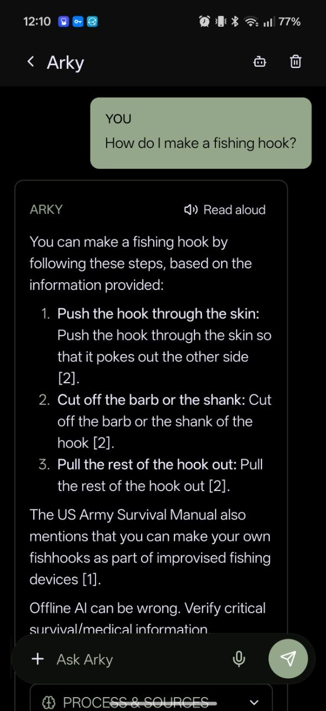
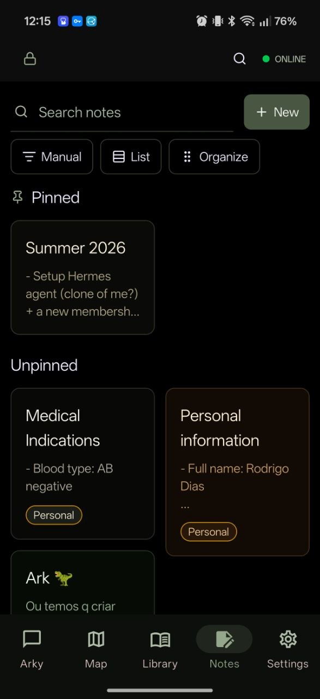

<p align="center">
  <picture>
    <source media="(prefers-color-scheme: dark)" srcset="assets/images/readme-logo-dark.png" />
    
  </picture>
</p>

<h1 align="center">Ark</h1>

<p align="center"><strong>Noé's Ark for the offline age.</strong></p>

<p align="center">
  <a href="https://github.com/rodrgds/ark/blob/main/LICENSE"></a>
  
  
  
  
</p>

Ark is an offline-first survival computer for iOS and Android. It combines downloadable maps, emergency knowledge packs, secure notes/documents, local search, on-device AI/RAG, cached feeds/weather, and practical sensor tools in one mobile app that remains useful after the internet disappears.

This repository is the beta/open-source development home for Ark. The app is not a substitute for emergency services, medical professionals, official local instructions, or verified field training.

## Why Ark

Most preparedness apps solve one narrow problem: maps, notes, PDFs, weather, or a chatbot. Ark's bet is that the useful version is integrated and local-first: one place to download what matters before a crisis, search it offline, annotate it privately, and use phone sensors when the network is gone.

Good references in the same orbit are offline navigation apps like OsmAnd/Organic Maps/CoMaps, offline knowledge readers like Kiwix, and survival/off-grid toolkits. Ark is different because it tries to connect those pieces into one private mobile command center instead of another single-purpose app.

## Features

- Offline maps, saved places, route drafts, region downloads, and navigation-data status.
- Downloadable knowledge library with guides, PDFs, ZIM archives, HTML snapshots, RSS feeds, imports, and full-text search.
- Private notes, document storage, vault protection, encrypted backups, soft delete, labels, favorites, and export paths.
- Ask Arky chat and source search over local documents, notes, and curated packs.
- Field tools: compass, barometer, level, pedometer, light meter, coordinates, weather cache, chronometer, diagnostics, and readiness checklists.
- Tracks for field recordings with route history, stats, markers, GPX export, and map overlays.
- Battery-aware settings, offline diagnostics, resumable downloads, and a command-search surface for quick navigation.

## Screenshots

<p align="center">
  
  
  
  
</p>

## Stack

- **App:** Expo SDK 57, React Native 0.86, Expo Router, TypeScript.
- **UI:** Uniwind/Tailwind CSS v4, RN primitives, lucide-react-native.
- **State/data:** Zustand, expo-sqlite, FTS, repository/service boundaries.
- **Offline maps:** MapLibre React Native plus app-managed offline map/routing packs.
- **Knowledge:** PDFs, Markdown/authored guides, Defuddle HTML snapshots, Kiwix ZIM archives.
- **AI:** llama.rn/GGUF adapter path, local RAG, deterministic fallback source matcher.
- **Native modules:** `ark-routing`, `ark-ocr`, `ark-zim`.
- **Package manager:** Bun.

## Getting started

```sh
git clone https://github.com/rodrgds/ark.git
cd ark
bun install
bun run dev
```

For a development build instead of Expo Go (required for maps, local AI, and native modules):

```sh
bun run android:build:dev
bun run android:install
```

## Documentation

- [User guide](docs/user/getting-started.md)
- [Maps and navigation](docs/user/maps-navigation.md)
- [Vault, notes, and backups](docs/user/vault-notes-backups.md)
- [Developer setup](docs/developer/setup.md)
- [Architecture](docs/developer/architecture.md)
- [Native builds](docs/developer/native-builds.md)
- [Release checklist](docs/release/release-checklist.md)
- [F-Droid preparation](docs/release/fdroid.md)

## Project status

Ark is beta-stage software. Core app flows exist, but this is not a polished store release yet. The most important remaining work is native-device verification, security hardening, checksum coverage, and real-world usability testing.

## Contributing

Contributions are welcome, especially around Android device testing, offline maps/routing, ZIM reading, download integrity, UI polish, docs, and small reliability fixes. Start with [CONTRIBUTING.md](CONTRIBUTING.md).

Security issues should not be reported in public issues. See [SECURITY.md](SECURITY.md).

## License

MIT. See [LICENSE](LICENSE).

Third-party content packs, maps, models, datasets, guides, and documentation sources keep their own licenses and terms. Ark's license covers this repository's code and project-owned assets only.
